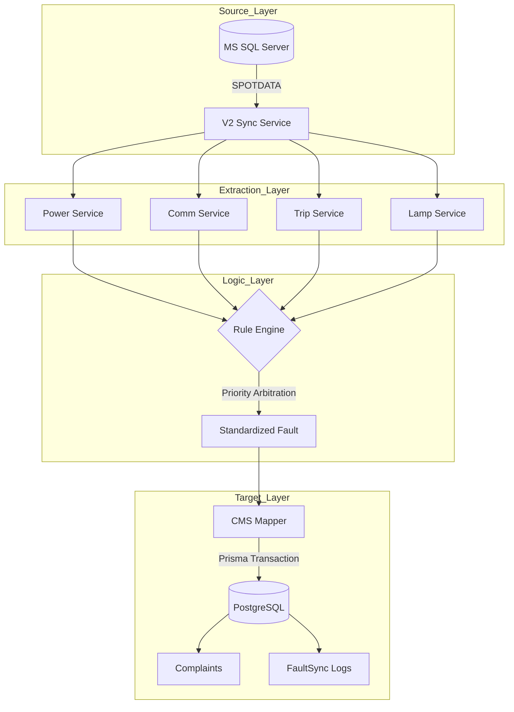

# Urban Voice: V2 Sync Service

A high-performance synchronization service that bridges industrial SQL Server hardware alerts with the Urban Voice CMS. This service uses a prioritized rule engine to transform raw panel telemetry into actionable, intelligent complaints.

## 🏗️ System Architecture

---

## 📚 Documentation Index

### 🚀 Core & Entry Points
- [System Overview & Entry Point](docs/index.md) - Startup flow and system orchestration.
- [Rule Engine Logic](docs/logic/RuleEngine.md) - Detailed breakdown of the "Winner Logic" priority system.
- [State Management](docs/logic/StateManager.md) - How we maintain the sync window and persistence.

### 🔍 Detection Services (Logic & Flow)
- [Communication Failure](docs/services/CommFail.md) - How we detect loss of communication using spot data.
- [Power Failure](docs/services/PowerFail.md) - Monitoring for total power outages.
- [Circuit Trip](docs/services/Trip.md) - Single and Three-phase trip detection.
- [Lamp failure](docs/services/Lamp.md) - Percentage-based fixture health calculation.

### 🛠️ Data Transformation & Utilities
- [CMS Mapper](docs/logic/CmsMapper.md) - Linking faults to the Urban Voice compliant schema.
- [Payload Builder](docs/logic/PayloadBuilder.md) - Standardization of internal fault objects.
- [CMS Utilities](docs/logic/CmsUtilities.md) - ID generation and category resolution rules.

### ⚙️ Configuration & Infrastructure
- [V2 Configuration File](docs/config/v2-config.md) - Understanding `v2-config.json`.
- [Core Config Loader](docs/config/ConfigLoader.md) - How we merge JSON and Env variables.
- [Database Adapters](docs/config/Database.md) - MSSQL and Prisma integration.
- [Logging Infrastructure](docs/config/Logging.md) - System, Audit, and Forensic logs.
- [Environment & Deployment](docs/config/environment.md) - PM2 and `.env` setup.

### ✅ Verification
- [Logic Validation & Tests](docs/tests/logic-validation.md) - Behavioral testing and regression guards.

---

## 🏃 Operation Modes

### Development Mode
In development, the service simulates synchronization without modifying the production database.
- **Trigger**: `IS_DEVELOPMENT=true` in `.env`.
- **Behavior**: Maps faults to payloads and logs them to `logs/dev-payloads.log`.
- **Run**: `npm run start:dev`

### Production Mode
In production, the service runs on a schedule and persists everything to PostgreSQL via transactions.
- **Trigger**: `IS_DEVELOPMENT=false`.
- **Behavior**: Auto-generates complaints and updates the internal state.
- **Run**: `npm run start:prod` (Managed by PM2)

---

## 🛠️ Tech Stack
- **Runtime**: Node.js (ES Projects)
- **Database**: MS SQL Server (Source), PostgreSQL (Target)
- **ORM**: Prisma (PostgreSQL), `mssql` (Source)
- **Scheduling**: `node-cron`
- **Logging**: `winston`
- **Validation**: `zod`
- **Testing**: `jest`
