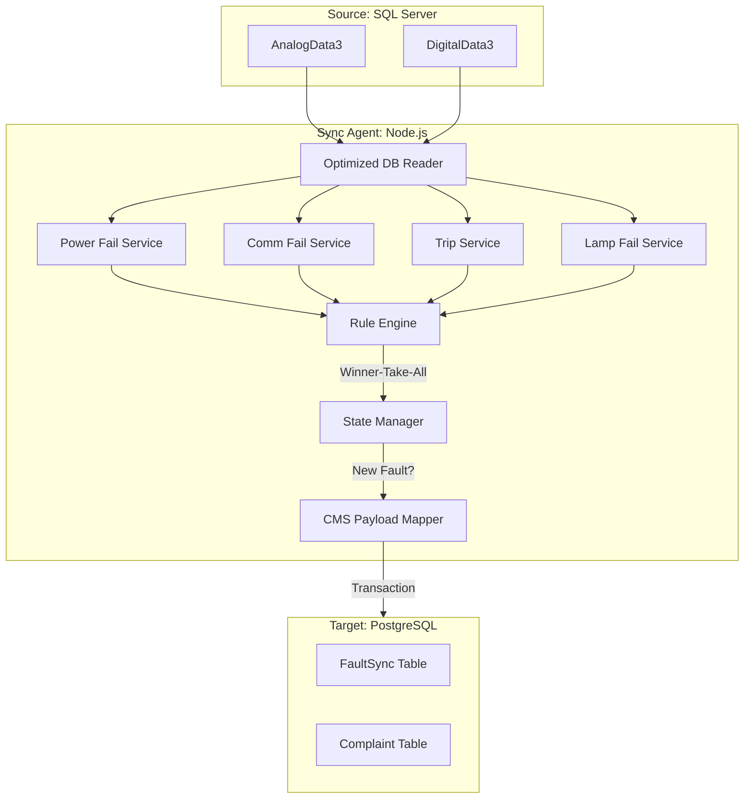

# 01. Architecture

## System Diagram

## Data Flow Pipeline (V2 Optimized)

1. **Polling Cycle**: The service wakes up on a configurable Cron schedule (e.g., `*/1 * * * *`).
2. **Data Fetching**:
   - Connects to SQL Server.
   - **Power Failures**: Scans `DigitalData` for `Tag16=0` in the last hour.
   - **Comm Failures**: Analytical query checking for stale digital data (>1h) and missing analog data (>24h).
   - **Circuit Trips / Lamp Failures**: Queries for newer records since the last processed timestamp.
3. **Rule Evaluation (Tiered Logic)**:
   - Evaluates detections through specialized services (`powerFail.service`, `commFail.service`, etc.).
   - **Winner-Take-All**: For a single RTU, only the most critical fault is promoted:
     - `Power Fail` > `Comm Fail` > `Trip` > `Lamp Fail`.
4. **State Management**:
   - **Deduplication**: Checks against local and remote state to ensure only *new* state changes trigger complaints.
   - Faults are only promoted if the device has transitioned from "Normal" to "Faulty".
5. **CMS Mapping**:
   - `src/cmsMapper.js` transforms normalized fault data into the specific PostgreSQL schema required by the CMS.
   - Resolves `complaintTypeId` and `complaintId` prefixing based on system configuration.
6. **Persistence**:
   - **Transaction**: Inserts are wrapped in Prisma transactions to ensure data consistency between operational logs and complaint tickets.
