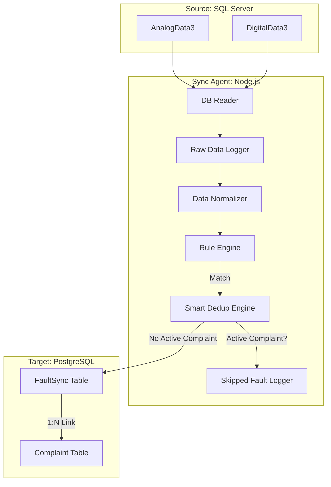

# 01. Architecture

## System Diagram

## Data Flow Pipeline

1. **Polling Cycle**: The service wakes up on a configurable Cron schedule (e.g., `*/5 * * * *`).
2. **Data Fetching**:
   - Connects to SQL Server.
   - Queries `AnalogData3` and `DigitalData3` for records newer than the `lastSyncTime`.
3. **Forensic Logging**:
   - Immediately writes fetched rows to `./log/raw_data_[TYPE]_[DATE].log`.
   - This ensures data is preserved even if processing fails later.
4. **Normalization**:
   - Converts the "wide" SQL table format (columns `Tag1`...`Tag64`) into a normalized stream of Data Points: `{ RTU, Tag, Value, Time }`.
5. **Rule Evaluation**:
   - Each Data Point is checked against `sync-config.json`.
   - If a rule matches (e.g., `Value > Threshold`), it is flagged as a **Fault**.
6. **Smart Deduplication**:
   - **Check**: Queries `FaultSync` for the latest entry regarding this `RTU + Tag`.
   - **Status Validation**: If a `FaultSync` exists, it checks the linked `Complaint`.
     - **OPEN/IN_PROGRESS**: The new fault is considered a duplicate. It is **skipped** and logged to `./log/skipped_faults_[DATE].log`.
     - **CLOSED/RESOLVED**: The new fault is considered a recurrence. A **new** `FaultSync` and `Complaint` are created.
7. **Persistence**:
   - **Transaction**: Both `FaultSync` and `Complaint` are inserted in a single database transaction to ensure integrity.
