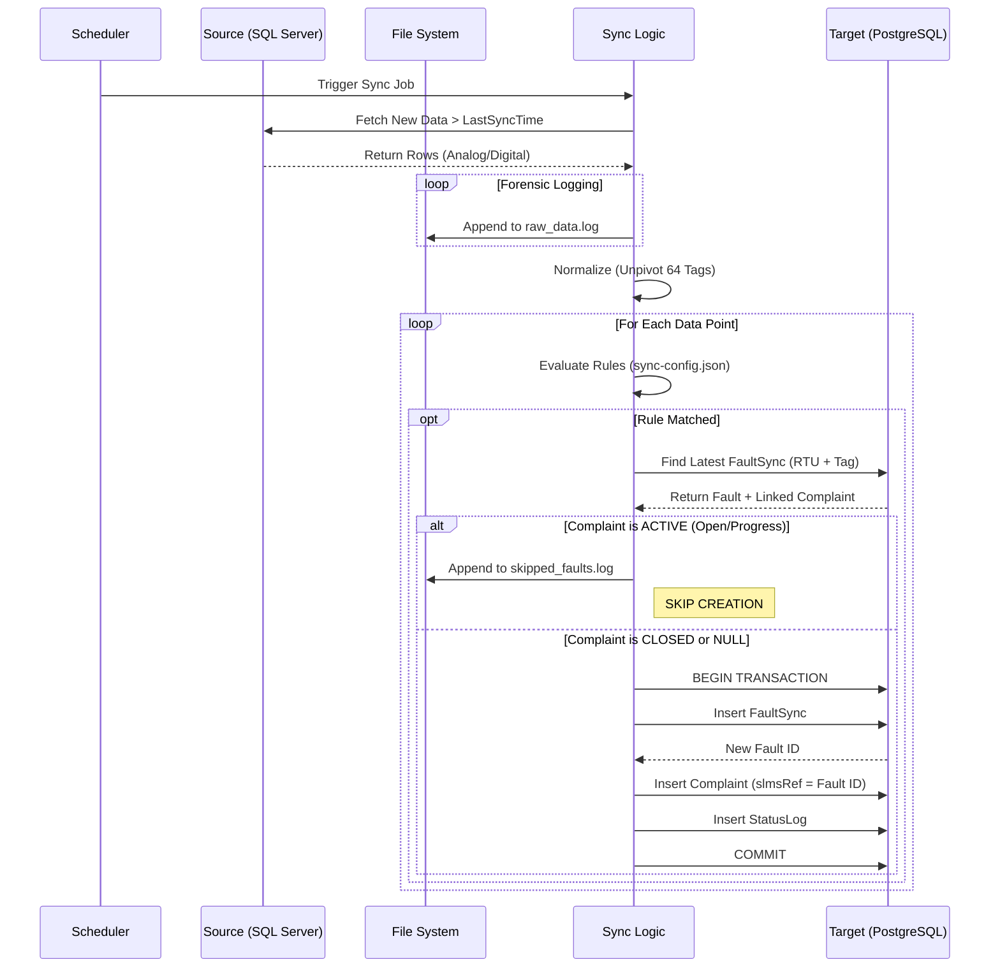

# 02. Workflow Sequence

This sequence diagram illustrates the decision-making process for a single polling cycle.

## Decision Steps
1. **Is it a Fault?** Determined by `ruleEngine.js`.
2. **Is it a Duplicate?** Determined by `dedupEngine.js` querying PostgreSQL.
3. **Action**: Write to DB or Write to Skipped Log.
