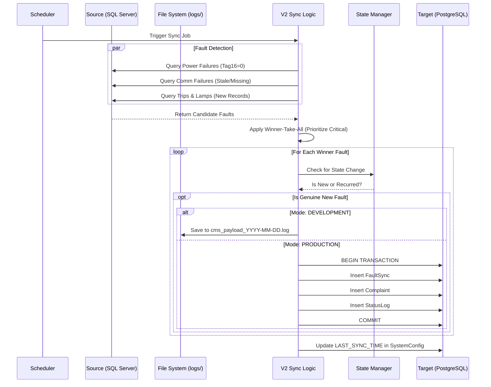

# 02. Workflow Sequence

This sequence diagram illustrates the decision-making process for the promoted V2 logic.

## Decision Steps
1. **Criticality Selection**: If an RTU has multiple issues, the system picks the most severe (e.g., Power Failure masks a Lamp Failure).
2. **State Transition**: A complaint is only generated if the device moves from a "Healthy" state to a "Faulty" state, or if the fault recurred after a closure.
3. **Operational Mode**:
   - **DEV**: Visualizes the payload meant for the CMS without making changes.
   - **PROD**: Directly creates tickets in the live CMS database.
