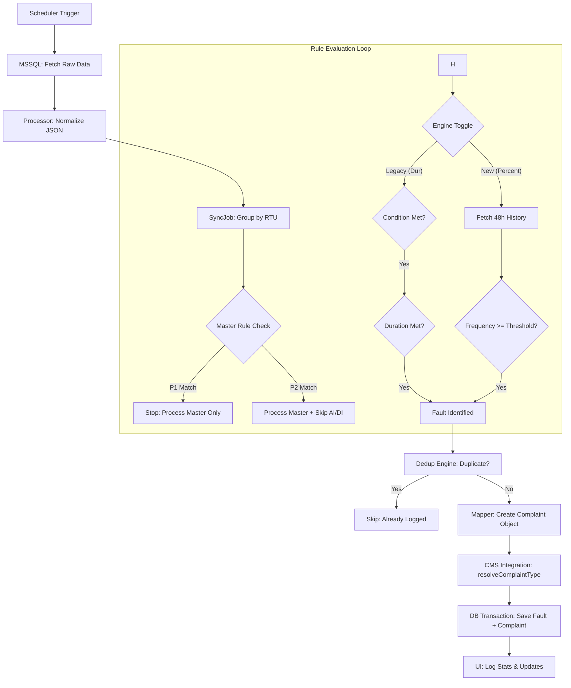

# 09. Rule Engine: End-to-End Flow

This document provides a technical deep-dive into the lifecycle of a data point, from the moment it is fetched from the Source SQL Database to the moment it is recorded as a Complaint in the CMS.

## Data Lifecycle Diagram



## Step-by-Step Execution Flow

### 1. Data Fetching (Source DB)
The `syncJob` initiates a connection to the MS SQL Server using `src/db/mssql.js`.
- **Source**: `AnalogData3` and `DigitalData` tables.
- **Filter**: Fetches records where `LogTime` is within the configured `lookbackHours` (calculated relative to `NOW()`).
- **Optimization**: Data is streamed and then normalized into a standard JSON format.

### 2. Normalization & Grouping
The `src/logic/dataProcessor.js` converts vendor-specific column names into a unified structure:
```json
{
  "rtuId": "2117",
  "tag": "Tag5", 
  "value": 2.88,
  "timestamp": "2026-02-06T13:45:00Z",
  "sourceType": "ANALOG"
}
```
Points are then **grouped by RTU ID**. This grouping is critical for cross-table prerequisite checks and Master Rule evaluation.

### 3. Master Rule Evaluation (Priority Handling)
Before any individual rule is checked, the `src/logic/masterRuleEngine.js` scans the RTU group:
- **Priority 1 (Blocking)**: If a rule like "Communication Fail" matches, the system logs it and **immediately stops** checking this RTU. This avoids generating thousands of "0" value faults when a panel goes offline.
- **Priority 2 (Window)**: If a rule like "Maintenance Mode" matches, it is logged, but it only blocks **normal** AI/DI rules. Other Master Rules can still trigger.

### 4. Rule Engine Evaluation
For non-blocked RTUs, the system checks the `useNewLogic` environment flag:

#### Standard Logic (Default)
`src/logic/ruleEngine.js` processes each point:
- **Filters**: Only rules matching the `tag` and `sourceType` (AI/DI) are considered.
- **Condition & Duration**: Evaluates persistence using Source DB history.

#### Percentage-Based Logic (`useNewLogic=true`)
`src/logic/percentageRuleEngine.js` performs a frequency-based check:
1. **History Fetch**: The service pre-fetches the last 48 hours of sensor data for the entire batch.
2. **Calculation**: `(FaultCount * 100) / TotalSamples`.
3. **Threshold**: Triggered if the fault occurs in a significant percentage of the recent samples (defined in `thresholdPercent`).

### 5. Deduplication
Even if a fault matches a rule, it may have already been synced in a previous cycle.
- **`src/logic/dedupEngine.js`** checks the `FaultSync` table for the same `rtuId`, `tag`, and `eventTime`.
- If found, the point is marked as **Skipped (Duplicate)**.

### 6. Mapping & CMS Integration
The raw data point is transformed into an Urban Voice Complaint using `src/logic/mapper.js`:
1. **Templates**: Titles and Descriptions are filled using `{{tag}}`, `{{value}}`, and `{{description}}`.
2. **Priorities**: Alarm types (MAJOR/CRITICAL) are mapped to CMS priorities (HIGH/CRITICAL).
3. **Complaint Type**: Resolved dynamically via `src/logic/cmsIntegration.js`.

### 7. Database Persistence
Finally, the system executes a **Prisma Transaction**:
1. Creates a record in `FaultSync` (Technical audit).
2. Creates a record in `Complaints` (Operational record).
3. Creates a `StatusLog` (Audit trail).

## Stats & Visibility
The result is summarized in the Logs:
`Sync Job Completed. Faults: 31 (Comm: 5), Skipped: 3037 (Dup: 27, Master: 3010)`
- **Faults**: Newly created complaints.
- **Comm**: Complaints specifically triggered by Master/Comm rules.
- **Skipped Master**: Subordinate faults hidden by a P1/P2 rule.
- **Skipped Dup**: Faults that were already in the DB.
