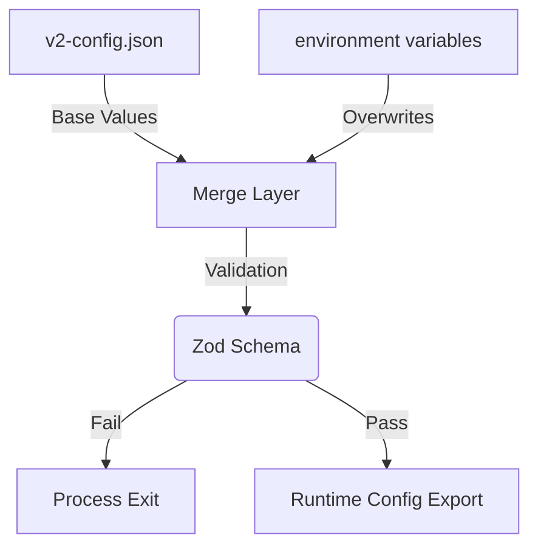

# Logic: Config Loader (src/config/configLoader.js)

## Purpose (WHY)
The `ConfigLoader` provides a single source of truth for the application's configuration. It implements a **Layered Merge Strategy** where environment variables take precedence over static JSON values, allowing for flexible deployments in different environments (UAT, Staging, Production).

## Responsibilities
- **Validation**: Uses `Zod` schemas to ensure all required fields are present and correctly typed before the application starts.
- **Merging**: Intelligently merges `v2-config.json` with `process.env`.
- **Singleton Access**: Provides a `getConfig()` method to ensure the configuration is only loaded and parsed once.

## Flow Explanation
1.  **Read**: Reads `v2-config.json`.
2.  **Merge**: 
    - Takes `service.schedule` from `process.env.SYNC_SCHEDULE` if available.
    - Resolves DB credentials from environment variables (`MSSQL_USER`, etc.).
    - Maps the Prisma `DATABASE_URL` for PostgreSQL.
3.  **Validate**: Passes the intermediate object through the `configSchema.parse()` method.
4.  **Export**: Saves the resulting object to an exported variable.

## Mermaid Merge Strategy

## Method-Level Explanation
- `loadConfig(path)`: Re-reads and merges the configuration.
- `getConfig()`: Safely returns the current configuration, auto-initializing if necessary.

## Input / Output Contracts
- **Input**: File system (`v2-config.json`) and `process.env`.
- **Output**: Validated Javascript Object matching the `configSchema`.
