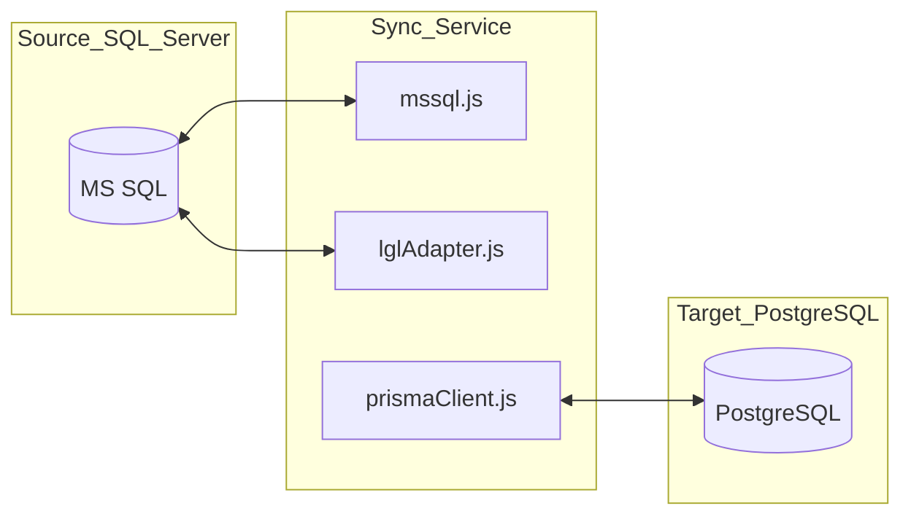

# Config: Database (src/db/)

## Purpose (WHY)
The V2 Sync Service operates in a heterogenous database environment, extracting data from a legacy **MS SQL Server** and persisting it to a modern **PostgreSQL** CMS. This requires specialized adapters to handle connection pooling, streaming, and transactional integrity across two different SQL dialects.

## Responsibilities
- **Source Adapter (`mssql.js`)**: Manages raw connection pooling and optimized queries for the industrial SQL Server backend.
- **Target ORM (`prisma.js`)**: Provides a type-safe interface for the PostgreSQL database, handling complex transactions for complaint generation.
- **Legacy Logic (`lglAdapter.js`)**: Provides specialized streaming and analytical queries (like `fetchJoinedDataStream`) used for complex fault detection.

## Flow Explanation
1.  **Source Extraction**: The rule engine uses `mssql.js` or `lglAdapter.js` to run analytical queries against the source system.
2.  **Target Persistence**: The service uses `prisma.js` (and the `prismaClient.js` singleton) to find existing complaints and insert new ones.
3.  **Cross-DB Transactions**: While we cannot have a single global transaction across both DBs, the service uses Prisma transactions to ensure that if a complaint is created, it is correctly linked to a `FaultSync` record in the target DB.

## Mermaid Database Architecture

## Method-Level Explanation
- `connectToSourceDb()`: Initializes the `mssql` pool if it doesn't exist (Singleton pattern).
- `getPrismaClient()`: Initializes the Prisma client with the dynamic `DATABASE_URL` from the config.
- `fetchJoinedDataStream()`: Implements a streaming interface for large datasets to keep memory usage low.

## Input / Output Contracts
- **Input**: `v2-config.json` (for credentials), `.env` (for URLs).
- **Output**: Recordsets (from MS SQL), Created Records (in PostgreSQL).
