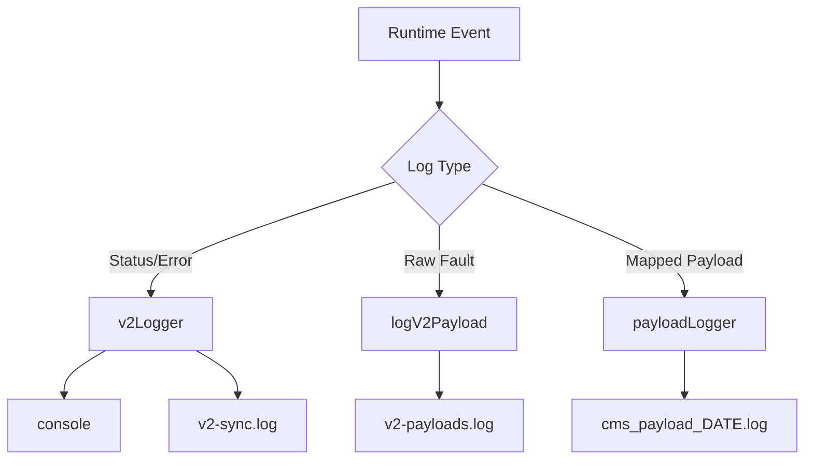

# Config: Logging (src/logger.js & src/payloadLogger.js)

## Purpose (WHY)
Logging is critical for monitoring the health of the sync service and for auditing the faults sent to the CMS. We separate standard system logs (errors, warnings, status) from specialized data payloads to ensure that developers can debug the process while forensics experts can audit the raw data.

## Responsibilities
- **v2Logger**: Standard `winston` logger for application health. Outputs to console and `logs/v2-sync.log`.
- **logV2Payload**: Internal JSON logger that wraps fault data for UI/diagnostic parsing. Outputs to `logs/v2-payloads.log`.
- **payloadLogger (CMS)**: Specialized file logger for the final payloads sent to the Urban Voice database. Creates daily log files (`cms_payload_YYYY-MM-DD.log`).

## Flow Explanation
1.  **Application Logs**: Errors and status updates are piped to `v2-sync.log`.
2.  **Internal Audit**: When a fault is detected, the raw fault object is passed to `logV2Payload`.
3.  **CMS Forensics**: In DEV mode (or as a fallback in PROD), the `payloadLogger` writes the final mapped JSON to a daily file for validation.

## Mermaid Logging Flow

## Method-Level Explanation
- `logV2Payload(payload)`: Wraps raw fault data in a `V2_FAULT` table metadata object for consistency with legacy UI tools.
- `payloadLogger.log(payload)`: Handles the filesystem logic for daily rotating log files.

## Input / Output Contracts
- **Input**: Strings (messages), Objects (meta-data), or Full JSON Payloads.
- **Output**: Formatted text files and structured JSON logs in the `./logs` directory.
