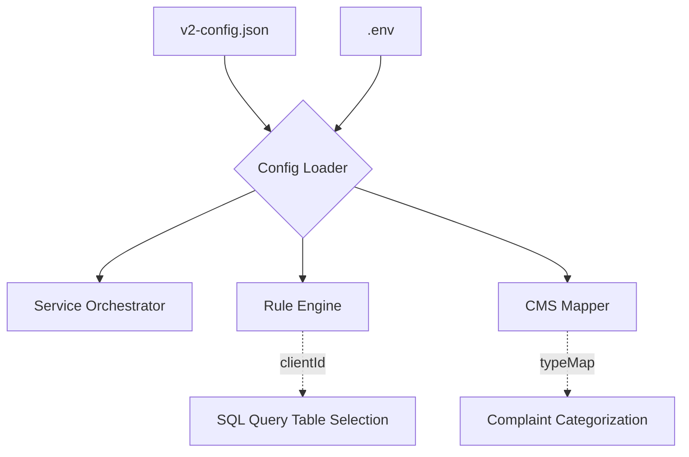

# Config: v2-config.json

## Purpose (WHY)
The `v2-config.json` file contains all the persistent, non-secret configuration parameters that define the behavior of the V2 Sync Service. It allows administrators to fine-tune sync intervals, rule logic (like lookback windows), and mapping defaults without modifying the source code.

## Responsibilities
- **Rule Definitions**: Defines the `clientId` and `deduplicationWindow`.
- **Sync Control**: Manages the `oneTimeCatchUp` and `dryRun` flags.
- **CMS Mapping**: Provides the template for transforming alerts into formal CMS complaints.

## Field Explanations
| Section | Field | WHY it exists |
| :--- | :--- | :--- |
| `service` | `isDevelopment` | Toggles between file-logging (DEV) and DB-persistence (PROD). |
| `service` | `oneTimeCatchUp` | If true, the system ignores its saved state and performs a full lookback on startup. |
| `syncRules` | `clientId` | Determines which Source SQL tables to query (e.g., `DigitalData3`). |
| `syncRules` | `lookbackHours` | The maximum window to search for faults in the source database. |
| `service` | `systemUserEmail` | The email of the system user in PostgreSQL that will "own" all sync complaints. Resolved to an ID at runtime. |
| `cmsMapping` | `complaintTypeMap` | Maps internal codes (`POWER_FAIL`) to names used in the CMS database. |

## Mermaid Config Mapping

