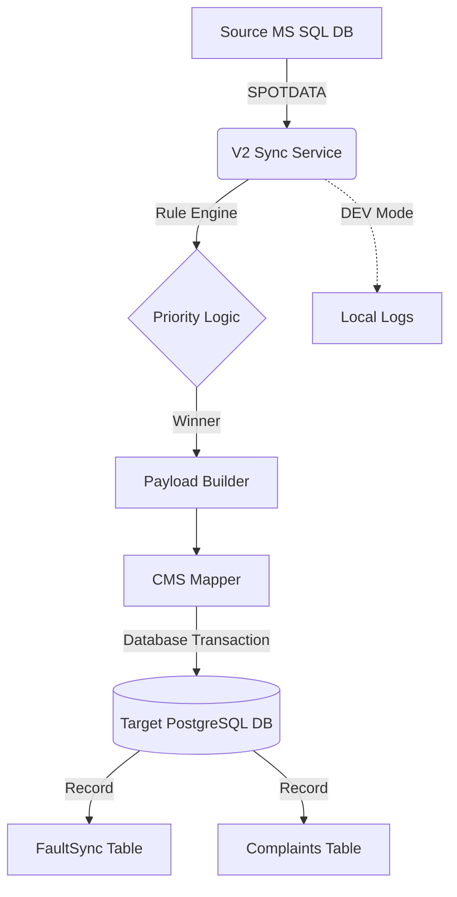
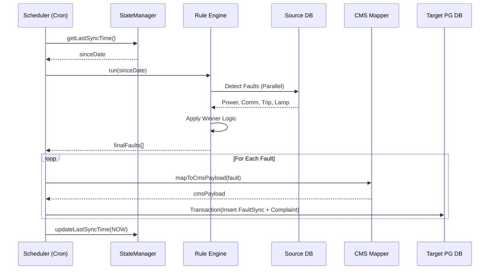

# System Entry Point: src/index.js

## Purpose (WHY)
The `src/index.js` file serves as the primary orchestrator and entry point for the V2 Sync Service. It is responsible for initializing the environment, connecting to databases, and scheduling the periodic synchronization of faults from the source SQL system to the Urban Voice CMS.

## Responsibilities
- **Bootstrapping**: Loading configurations, environment variables, and initializing the logger.
- **Scheduling**: Managing the `node-cron` schedule for recurring sync runs.
- **Orchestration**: Coordinating the flow between the `StateManager`, `RuleEngine`, and `CmsMapper`.
- **Persistence**: Managing database transactions to ensure data integrity when inserting `FaultSync` and `Complaint` records.
- **State Management**: Tracking the last successful sync time to maintain a sliding window for data extraction.

## System Architecture Diagram

## Runtime Workflow Diagram

## Flow Explanation
1.  **Initialization**: On startup, the service establishes a connection to the source SQL Server and determines its operating mode (DEV vs PROD).
2.  **Scheduling**: In PROD mode, a cron job is registered based on `SYNC_SCHEDULE`. In DEV mode, the sync runs immediately.
3.  **Synchronization Loop (`runSync`)**:
    - Checks if a sync is already in progress to prevent overlapping runs.
    - Retrieves the `sinceDate` from the `StateManager` (calculated from the last successful run).
    - Invokes `RuleEngine.run(sinceDate)` to fetch and filter actionable faults.
    - Iterates through detected faults, mapping them to the CMS schema.
    - In PROD, it wraps the `FaultSync` creation and `Complaint` creation in a single Prisma transaction.
    - Updates the internal state with the current timestamp upon successful completion.

## Method-Level Explanation
-   `runSync()`: The main loop handler. Manages concurrency flags and orchestration.
-   `persistToDatabase(fault)`: Handles the transaction logic. Includes a "Smart Loop" check to skip duplicate RTU complaints if an active one already exists.

## Input / Output Contracts
- **Input**: `v2-config.json`, `.env` variables, Source SQL recordsets.
- **Output**: `FaultSync` records (PG), `Complaint` records (PG), `v2-payloads.log` (Internal logs), `dev-payloads.log` (DEV mode file output).
