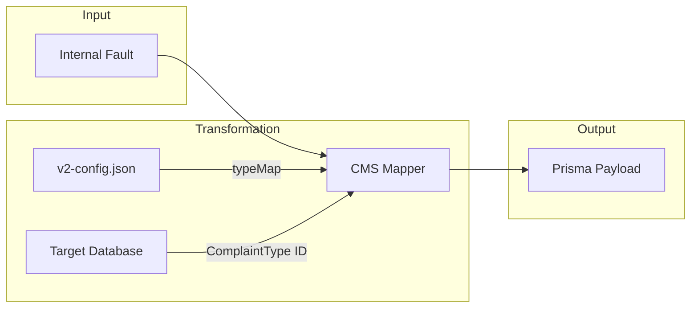

# Logic: CMS Mapper (src/cmsMapper.js)

## Purpose (WHY)
The `CMS Mapper` bridges the gap between the internal representation of a "Fault" and the specific database schema required by the **Urban Voice CMS**. It handles complex tasks like generating human-readable titles, calculating SLAs (Service Level Agreements), and resolving foreign key relationships (e.g., Complaint Type IDs).

## Responsibilities
- **System User Resolution**: Dynamically resolves the technical user ID from the `SystemConfig` email address using `resolveSystemUser`.
- **ID Generation**: Generates sequential, human-readable IDs (e.g., `KMC00033`).
- **Type Mapping**: Translates raw fault types (`POWER_FAIL`) into formal CMS types (`Unavailability of incoming power supply`) based on configuration.
- **SLA Calculation**: Calculates the `deadline` based on the `slaHours` defined for each complaint type in the target database.
- **Priority Assignment**: Assigns HIGH/MEDIUM/LOW priority based on the severity of the fault type.
- **Contact Defaults**: Supplies required contact information (phone/email/name) for system-generated complaints.

## Flow Explanation
1.  **Fault Input**: Receives a standardized fault object from the Rule Engine.
2.  **External Lookups**:
    - Calls `resolveSystemUser()` to get the current system user ID by email.
    - Calls `generateComplaintId()` to get the next sequential ID.
    - Calls `resolveComplaintType()` to find the matching integer ID for the complaint category in the PostgreSQL database.
3.  **String Templating**: Builds a multi-line `description` containing the detailed fault report (Type, Value, Tag, Time).
4.  **JSON Metadata**: Stringifies all raw fault data into a `tags` field for deep-link debugging in the UI.

## Mermaid Mapping Diagram

## Method-Level Explanation
- `mapToCmsPayload(fault, tx)`: The core mapping function. It requires a database transition `tx` (Prisma) to perform lookups and ensure the mapping is consistent with the current database state.

## Input / Output Contracts
- **Input**: `Fault` object + `tx` (Prisma Client).
- **Output**: Full Prisma `complaint.create` input object.
