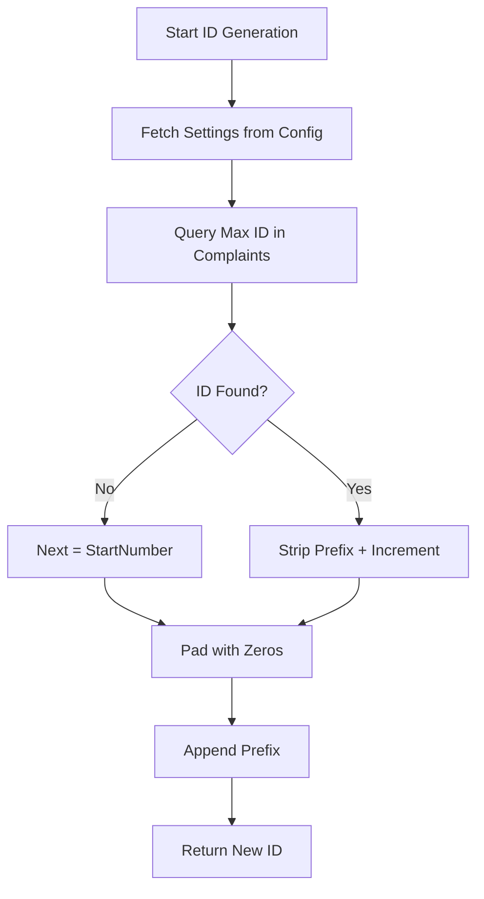

# Logic: CMS Integration Utilities (src/utils/cmsIntegration.js)

## Purpose (WHY)
The `cmsIntegration.js` file contains highly specialized logic required to remain compatible with the main Urban Voice CMS. It ensures that system-generated complaints follow the exact same business rules as those created by human users, including ID formatting and category resolution.

## Responsibilities
- **Sequential ID Generation**: Implements the algorithm for incrementing alpha-numeric complaint IDs (e.g., `KSC0001` -> `KSC0002`).
- **Dynamic Category Resolution**: Resolves human-readable complaint names into internal database IDs, supporting both modern table lookups and legacy configuration fallbacks.
- **SLA Inheritance**: Extracts the `slaHours` for a given type to help the mapper calculate the resolution deadline.

## Flow Explanation
1.  **ID Generation**:
    - Fetches prefix and start number from the `SystemConfig` table.
    - Finds the current maximum ID in the `Complaint` table.
    - Increments and pads the number to the configured length.
2.  **Type Resolution**:
    - Takes a string input (e.g., "Lamp Failure").
    - Searches the `ComplaintType` table.
    - If not found, scans the `SystemConfig` table for JSON definitions starting with `COMPLAINT_TYPE_`.

## Mermaid ID Generation Flow

## Method-Level Explanation
- `generateComplaintId(tx)`: Performs the sequential increment logic. Requires a Prisma transaction `tx` to ensure consistency.
- `resolveComplaintType(tx, typeInput)`: Handles the multi-layered lookup logic for complaint categories.

## Input / Output Contracts
- **Input**: Prisma transaction client and string/number identifiers.
- **Output**: Formatted ID strings or Resolved Category objects ({ id, name, slaHours }).
