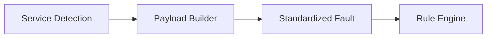

# Logic: Payload Builder (src/payloadBuilder.js)

## Purpose (WHY)
The `Payload Builder` is a simple utility that converts the raw output of detection services into a standardized "V2 Fault" object. This ensures that regardless of which service detected the fault (Lamp vs Power), the Rule Engine and CMS Mapper receive a consistent data structure.

## Responsibilities
- **Type Casting**: Ensures RTU IDs are numbers and timestamps are in ISO format.
- **Defaulting**: Provides fallback descriptions and calculates `failurePercent` (Default 100% for binary/system faults, actual percentage for lamp failures).
- **Metadata Tagging**: Preserves the original `tag` and `value` for debugging.

## Flow Explanation
The builder acts as a constructor-like function that takes a raw detection result and returns a flat, strictly-typed object.

## Mermaid Workflow diagram


## Method-Level Explanation
- `buildPayload(rtuId, fault)`: Standardizes the `rtuNumber`, `panelName`, `faultType`, and `detectedAt` fields.

## Input / Output Contracts
- **Input**: `rtuId` (String/Number) and `fault` details.
- **Output**: 
  ```json
  {
      "rtuNumber": 123,
      "panelName": "RTU-123",
      "faultType": "...",
      "description": "...",
      "failurePercent": "Number (100 for binary, rounded % for lamp)",
      "detectedAt": "ISO Date",
      "tag": "TagX",
      "value": 1
  }
  ```
