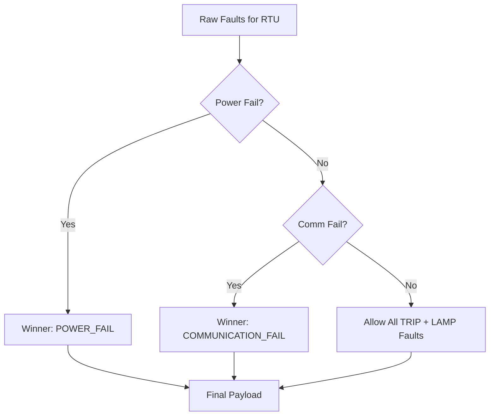

# Logic: Rule Engine (src/ruleEngine.js)

## Purpose (WHY)
The `RuleEngine` is the brain of the V2 Sync Service. Its primary purpose is to take raw, overlapping detections from multiple services and determine which faults are actually actionable. It resolves conflicts (e.g., preventing a "Lamp Failure" complaint if the whole "Power" is down) and aggregates multiple minor faults for a single RTU.

## Responsibilities
- **Parallel Detection Loop**: Orchestrates the four specialized services concurrently to minimize execution time.
- **Aggregation**: Groups all raw detections by `rtuId`.
- **Conflict Resolution (Winner Logic)**: Applie prioritization rules to ensure only the root cause is reported when cascading failures occur.
- **Payload Sanitization**: Prepares standardized data for the `payloadBuilder`.

## Flow Explanation
1.  **Extraction Phase**: Calls `Promise.all` on Power, Comm, Trip, and Lamp services.
2.  **Aggregation Phase**: Builds a `Map` where each key is an `RTU ID` and the value is an array of all detected faults for that unit.
3.  **Arbitration Phase (Priority Logic)**:
    - **Step A**: If `POWER_FAIL` exists, it "Wins". All other faults for this RTU are discarded.
    - **Step B**: If no Power Fail, but `COMMUNICATION_FAIL` exists, it "Wins".
    - **Step C**: If neither exists, then `TRIP` and `LAMP_FAILURE` faults are allowed to **co-exist**. This ensures if one circuit trips and another phase has lamp failures, both are recorded.

## Mermaid Priority Diagram

## Method-Level Explanation
- `run(sinceDate)`: The main entry point. Orchestrates the full pipeline from raw fetch to final payload generation.

## Input / Output Contracts
- **Input**: `sinceDate` (from state manager).
- **Output**: Array of formatted payload objects ready for the CMS Mapper.
