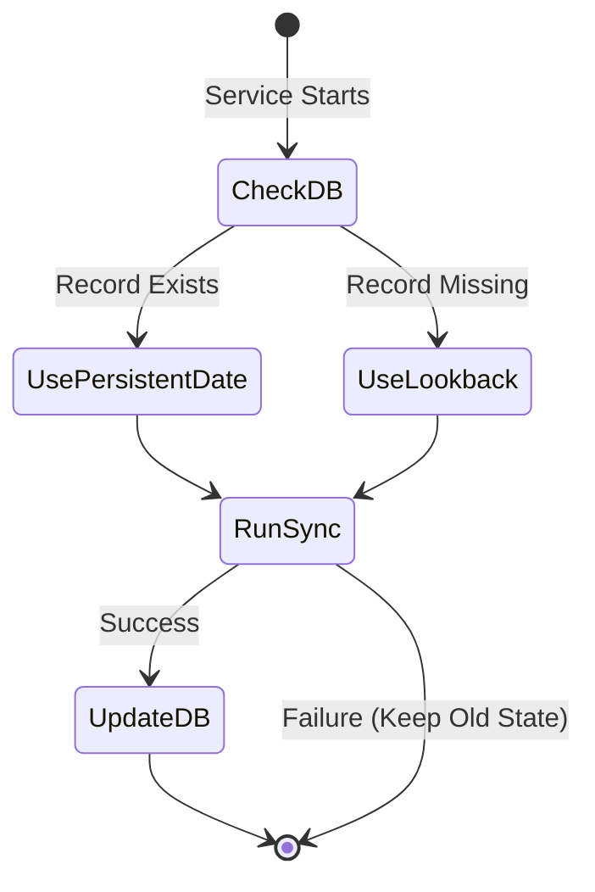

# Logic: State Manager (src/stateManager.js)

## Purpose (WHY)
The `StateManager` ensures that the sync service has "memory". Without it, the service would either process the same faults repeatedly or miss faults that occurred while the service was offline. By persisting the `LAST_SYNC_TIME` in the database, the service can maintain a precise "sliding window" for data extraction.

## Responsibilities
- **Persistence**: Reads and writes the last successful sync timestamp to the `SystemConfig` table in PostgreSQL.
- **Fail-safe Logic**: Provides a fallback mechanism using `lookbackHours` if no previous state exists.
- **Sanity Checks**: Detects and corrects "future dates" in the sync state (which might occur due to server clock drifts).

## Flow Explanation
1.  **Window Calculation**: At the start of a run, the service asks the State Manager for the `getLastSyncTime()`.
2.  **Fallback**: If it's the first run, the manager returns `NOW - lookbackHours`.
3.  **Update**: After a successful sync run, the service calls `updateLastSyncTime(NOW)` to move the window forward.

## Mermaid State Flow

## Method-Level Explanation
- `getLastSyncTime()`: Retrieves the ISO date string from the `SystemConfig` table and converts it to a `Date` object.
- `updateLastSyncTime(date)`: Uses a Prisma `upsert` to either create or update the sync key for the specific `clientId`.

## Input / Output Contracts
- **Input**: Database records from `SystemConfig`.
- **Output**: A standard JavaScript `Date` object representing the start of the next sync window.
