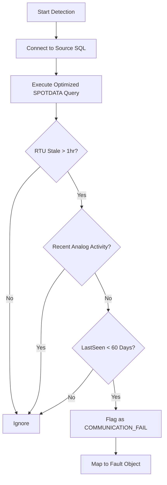

# Service: CommFailService (src/services/commFail.service.js)

## Purpose (WHY)
The `CommFailService` identifies RTUs (Remote Terminal Units) that have stopped communicating with the central system. It distinguishes between a temporary network glitch and a genuine communication failure by analyzing real-time "spot" data and movement patterns over time.

## Responsibilities
- **Data Source Selection**: Queries `DIGITALSPOTDATA` and `ANALOGSPOTDATA` for the most recent status.
- **Stale Data Detection**: Identifies RTUs that haven't sent a digital status update in over 1 hour.
- **Activity Filtering**: Excludes RTUs that are confirmed "active" via recent Analog data (even if digital is missing).
- **Discontinuation Logic**: Excludes old or decommissioned RTUs (those inactive for > 60 days/1440 hours).

## Flow Explanation
The service performs a single, complex SQL query to optimize performance:
1.  **Joins**: It joins Digital Spot Data with Analog Spot Data, RTU Master (for descriptions), and Lamp Type/SLC Mappings.
2.  **Time Constraint**: It filters for records where the `datetimefield` is older than 1 hour.
3.  **Active Exclusion**: It uses a `NOT IN` subquery to remove any RTUs that have sent Analog data within the last 1440 hours, ensuring we don't flag panels that are simply reporting via analog channels.

## Mermaid Flow Diagram


## Method-Level Explanation
- `detect()`: The primary entry point. Executes the SQL query and maps the results to a standardized fault object.

## Input / Output Contracts
- **Input**: `clientId` (from config), `DIGITALSPOTDATA`, `ANALOGSPOTDATA`.
- **Output**: Array of fault objects:
  ```json
  {
    "rtuId": "String",
    "type": "COMMUNICATION_FAIL",
    "tag": "Tag8",
    "val": 0,
    "description": "Panel Description",
    "time": "Date"
  }
  ```
