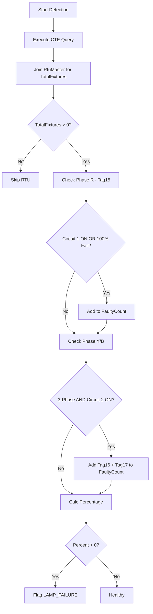

# Service: LampFailureService (src/services/lampFailure.service.js)

## Purpose (WHY)
The `LampFailureService` calculates the percentage of failed street lights for a given panel. Unlike binary faults (Power/Comm/Trip), lamp failures can be partial. The system needs to know *how many* lamps are down out of the *total expected* to determine if an actionable complaint should be raised.

## Responsibilities
- **Capacity Mapping**: Joins with `RtuMaster (m.TotalLED)` to get the "Denominator" (Total Fixtures).
- **Proportional Analysis**: Analyzes `Tag15`, `Tag16`, and `Tag17` (representing failed lamp counts on different phases) against the total capacity.
- **Contextual Awareness**: Cross-references `DigitalData` (`Tag1` and `Tag3`) to determine if a circuit is ON. Failures are only counted if the circuit is supposed to be active, or if the failure count is 100%.

## Flow Explanation
1.  **Data Extraction**:
    - Fetches the latest Digital status (`Tag1`, `Tag3`) and Analog lamp counts (`Tag15-17`).
    - Performs a `LEFT JOIN` on `RtuMaster` to find the `TotalLED` count for the RTU.
2.  **Calculation Logic**:
    - If `TotalFixtures` is 0, the RTU is skipped (improperly configured).
    - **Single Phase Logic**: Checks if Circuit 1 is ON. If yes, adds `Tag15` to the faulty count.
    - **Three Phase Logic**: If configuration supports it, checks if Circuit 2 is ON. If yes, adds `Tag16` and `Tag17` to the count.
    - **Override**: If the reported failure count equals or exceeds the total, it is counted even if the circuit appears "OFF" to catch latched fault conditions.
3.  **Standardization**: Calculates `(faulty * 100) / total` and filters for any percent > 0.

## Mermaid Flow Diagram


## Method-Level Explanation
- `detect(sinceDate)`: The main orchestration method. Note: It ignores the `sinceDate` passed in, favoring a 24-hour persistent window to ensure consistent percentage reporting in the UI.

## Input / Output Contracts
- **Input**: Digital/Analog records + `RtuMaster` static data.
- **Output**: Array of fault objects:
  ```json
  {
    "rtuId": "String",
    "type": "LAMP_FAILURE",
    "tag": "Tag26",
    "val": "Number (float)",
    "pct": "Number (rounded int)",
    "description": "...",
    "time": "Date"
  }
  ```
