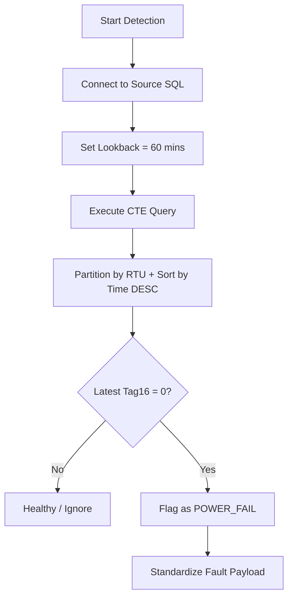

# Service: PowerFailService (src/services/powerFail.service.js)

## Purpose (WHY)
The `PowerFailService` is responsible for detecting total power loss at a transformer or panel. Since a power failure is the root cause of both "Communication Failure" and "Lamp/Trip Faults", this service identifies the most critical hardware fault in the system hierarchy.

## Responsibilities
- **Critical Fault Identification**: Monitors `Tag16` in the digital data stream.
- **Windowed Lookback**: Analyzes data within a sliding 60-minute window to ensure only active/recent failures are flagged.
- **Deduplication**: Uses windowed logic to identify the latest state of each RTU within the detection period.

## Flow Explanation
1.  **Table Selection**: Dynamically selects the digital data table based on the configured `clientId` (e.g., `DigitalData3`).
2.  **Window Calculation**: Calculates an `effectiveSince` date (current time minus 60 minutes).
3.  **SQL Execution**: 
    - Uses a Common Table Expression (CTE) with `ROW_NUMBER()` partitioned by `RTUNumber`.
    - Sorts records by `DateTimeField` in descending order to isolate the absolute latest status.
    - Filters for records where `Tag16 = 0` (Power Fail).
4.  **Mapping**: Converts SQL rows into standardized `POWER_FAIL` fault objects.

## Mermaid Flow Diagram


## Method-Level Explanation
- `detect(sinceDate)`: Checks for active power failures. note: Although `sinceDate` is passed from the orchestrator, this service enforces a strict 60-minute cap as per technical requirements to avoid flagging stale power outages once communication is restored.

## Input / Output Contracts
- **Input**: Digital data records with `Tag16`.
- **Output**: Array of fault objects:
  ```json
  {
    "rtuId": "String",
    "type": "POWER_FAIL",
    "tag": "Tag16",
    "val": 0,
    "description": "Power Supply Not Available",
    "time": "Date"
  }
  ```
