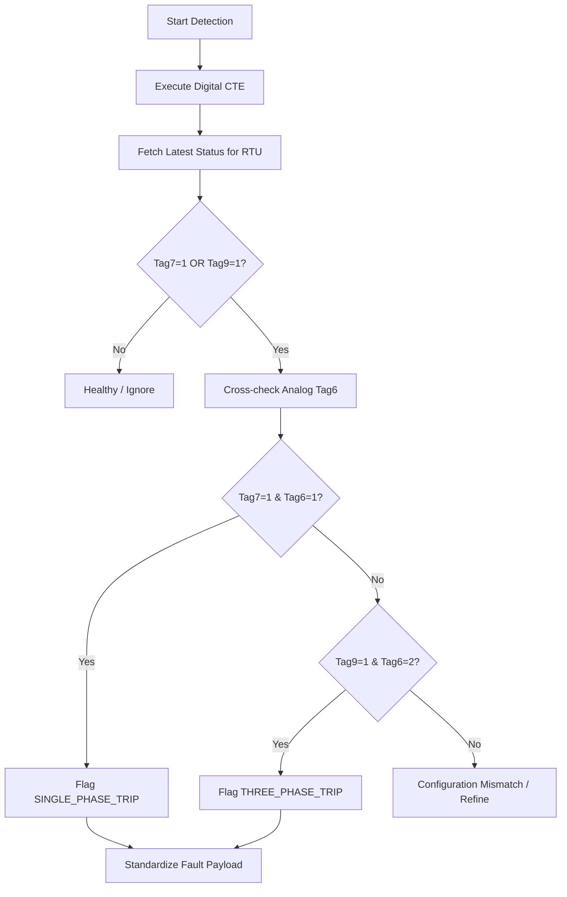

# Service: TripService (src/services/trip.service.js)

## Purpose (WHY)
The `TripService` identifies partial circuit failures within a lighting panel. It distinguishes between a single-phase trip (one phase of the circuit is down) and a three-phase trip (entire circuit trip but panel power is still available). This enables maintenance teams to identify localized electrical faults quickly.

## Responsibilities
- **Multi-Table Correlation**: Joins `DigitalData` (fault indicators) with `AnalogData` (phase configuration) to confirm the nature of the trip.
- **Phase Validation**: Checks `Tag6` (Phase Status) to ensure the faulty tag matches the physical phase configuration (Single vs Three).
- **Persistent Fault Detection**: Uses a 24-hour lookback to ensure active trips are reported, even after service restarts.

## Flow Explanation
1.  **Fault Identification**:
    - `Tag7 = 1`: Potential Single Phase Trip.
    - `Tag9 = 1`: Potential Three Phase Trip.
2.  **Validation Loop**:
    - For each RTU with a digital fault flag, the service fetches the `TOP 1` (latest) `Tag6` from the Analog table.
3.  **Arbitration**:
    - If `Tag7 = 1` AND `Tag6 = 1` (Single Phase Config) -> `SINGLE_PHASE_TRIP`.
    - If `Tag9 = 1` AND `Tag6 = 2` (Three Phase Config) -> `THREE_PHASE_TRIP`.

## Mermaid Flow Diagram


## Method-Level Explanation
- `detect(sinceDate)`: The main logic handler. Overrides `sinceDate` internally with a 24-hour window to maintain daily continuity.

## Input / Output Contracts
- **Input**: Digital and Analog records.
- **Output**: Array of fault objects:
  ```json
  {
    "rtuId": "String",
    "type": "SINGLE_PHASE_TRIP | THREE_PHASE_TRIP",
    "tag": "Tag7 | Tag9",
    "val": 1,
    "description": "...",
    "time": "Date"
  }
  ```
