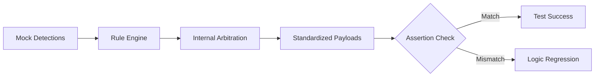

# Tests: Logic Validation (__tests__/)

## Purpose (WHY)
The test suite ensures that as the system evolves, the core "Winner Logic" and "Standardization" rules remain intact. Since the service handles critical power and safety infrastructure, regression testing is essential to prevent high-priority faults (like Power Failure) from being suppressed by minor ones during future updates.

## Responsibilities
- **Prioritization Validation**: Confirms that Power > Comm > Trip + Lamp.
- **Aggregation Testing**: Ensures multiple low-priority faults are correctly grouped and emitted for single RTUs.
- **Service Isolation**: Uses `jest.unstable_mockModule` to isolate the Rule Engine from actual database connections during testing.

## Validated Behaviors
| Context | Scenario | Expected Outcome |
| :--- | :--- | :--- |
| **P1 Supremacy** | Power Fail + Lamp Fail detected for RTU 101. | Only the `POWER_FAIL` payload is generated. |
| **P2 Supremacy** | Comm Fail + Lamp Fail detected for RTU 101. | Only the `COMMUNICATION_FAIL` payload is generated. |
| **Fault Co-existence**| Circuit Trip + Lamp Failure detected for RTU 202. | Two separate payloads are generated (One for Trip, one for Lamp). |

## Mermaid Verification Flow

## Method-Level Explanation
- `test('should prioritize Power Failure over everything else')`: Validates that the "Stop" logic in the RTU aggregation loop works correctly for P1 faults.
- `test('should allow multiple Trip and Lamp faults...')`: Validates that the fallback logic correctly appends multiple events for complex failure states.
