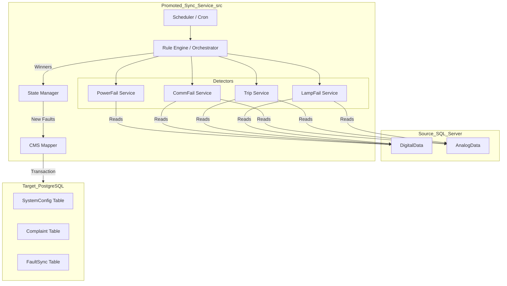

# V2 Sync Service Architecture (Current)

## 1. System Overview
The **V2 Sync Service** is the primary sync engine. It processes OT data from SQL Server and synchronizes faults to Urban Voice (PostgreSQL) using a strictly prioritized "Winner-Take-All" logic.

### Core Philosophy
*   **Service-Oriented**: Each fault type is handled by a dedicated service (e.g., `src/services/powerFail.service` ...).
*   **Priority-Driven**: A single RTU can only have ONE "primary" fault state in a sync window (Power > Comm > Trip > Lamp).
*   **Persistent State**: Tracks transitions between healthy and faulty states in the `SystemConfig` table.

---

## 2. Architecture Diagram

---

## 3. Rule Evaluation Logic

The `RuleEngine` orchestrates the priority logic:

1.  **High Priority**: Power Failure (`Tag16=0`).
2.  **Medium Priority**: Communication Failure (Stale data + explicit Tag8 status).
3.  **Low Priority**: Circuit Trips and Lamp Failures.

### Detailed Rules

#### A. Power Failure
*   **Trigger**: `Tag16` == `0`.
*   **Duration**: Validated for persistent failure.

#### B. Communication Failure
*   **Trigger**:
    *   `Tag8` == `0` (Latest status is 'Not Communicating')
    *   **AND** Data is Stale: `Digital.LastSeen` > 1 Hour ago.
    *   **AND** Data is Missing: `Analog` has NO records in the last 24 Hours.
*   **Ignore List**: Devices inactive for > 60 Days are considered discontinued.

#### C. Circuit Trips
*   **Single Phase**: `Tag7=1` AND `Analog.Tag6=1`.
*   **Three Phase**: `Tag9=1` AND `Analog.Tag6=2`.

#### D. Lamp Failure
*   **Calculation**: Multi-phase smart percentage calculation.
*   **Trigger**: Percentage > 0%.

---

## 4. Commands

| Mode | Command | Execution |
|------|---------|-----------|
| **Production** | `npm run start:prod` | Inserts into PostgreSQL |
| **Development** | `npm run start:dev` | Logs payloads to `logs/` |
| **Rollback** | `npm run start:legacy` | Runs V1 logic from `/legacy-code/` |
